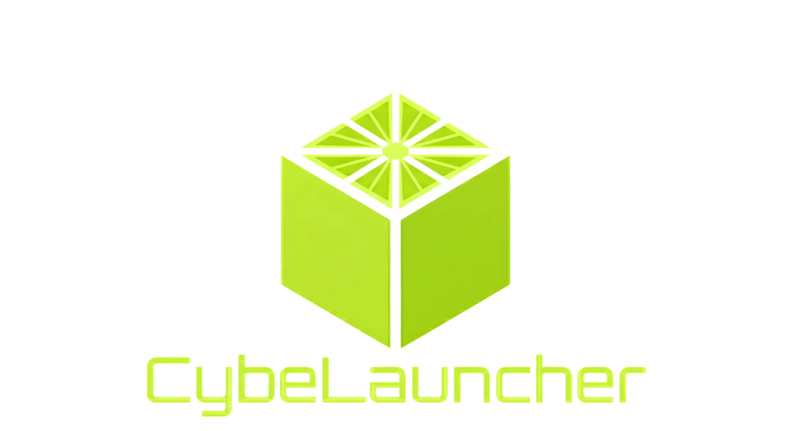
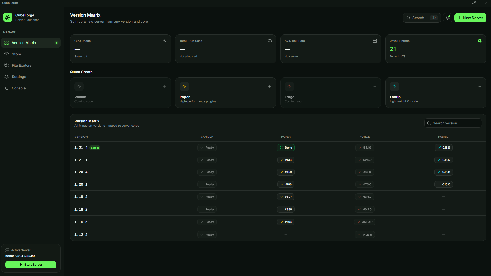

<p align="center">
  
</p>

<h1 align="center">CubeLauncher</h1>

<p align="center">
  Desktop application for simple Minecraft server management.
</p>

<p align="center">
  
  
  
  
</p>

---

> ⭐ If you like the project, consider giving it a star.

---

<details open>
<summary>🇬🇧 <strong>English</strong></summary>

## About

CubeLauncher is a desktop application that simplifies creating and managing Minecraft servers.

The goal of the project is to make local server management easier and remove repetitive tasks like downloading server cores, editing configuration files manually and maintaining multiple test environments.

<p align="center">
  
</p>

## Features

- Vanilla, Paper and Fabric installation
- Multiple isolated server instances
- Built-in file manager
- Server monitoring (CPU, RAM, TPS)
- Editing `.properties` and `.yml`
- Simple start/stop controls

## Tech Stack

<p>
  
  
  
  
  
</p>

## Installation

```bash
git clone https://github.com/CTPAX4OK/CubeLauncher.git
cd CubeLauncher
npm install
npm run desktop
```

## Status

The project is currently under development and some features may change.

</details>

---

<details>
<summary>🇷🇺 <strong>Русский</strong></summary>

## О проекте

CubeLauncher — десктопное приложение, созданное для более удобного управления серверами Minecraft.

Основная идея проекта — убрать лишнюю рутину: ручную установку ядер, постоянное редактирование конфигов и создание отдельных окружений для тестирования.

<p align="center">
  
</p>

## Возможности

- Установка Vanilla, Paper и Fabric
- Несколько изолированных серверов
- Встроенный файловый менеджер
- Мониторинг CPU, RAM и TPS
- Редактирование `.properties` и `.yml`
- Простое управление запуском сервера

## Технологии

<p>
  
  
  
  
  
</p>

## Установка

```bash
git clone https://github.com/CTPAX4OK/CubeLauncher.git
cd CubeLauncher
npm install
npm run desktop
```

## Статус

Проект всё ещё находится в разработке, поэтому некоторые функции могут измениться.

</details>

---

<details>
<summary>🇺🇦 <strong>Українська</strong></summary>

## Про проєкт

CubeLauncher — це десктопний застосунок для більш зручного керування серверами Minecraft.

Мета проєкту — прибрати зайву рутину: ручне встановлення ядер, постійне редагування конфігів та створення окремих середовищ для тестування.

<p align="center">
  
</p>

## Можливості

- Встановлення Vanilla, Paper та Fabric
- Кілька ізольованих серверів
- Вбудований файловий менеджер
- Моніторинг CPU, RAM та TPS
- Редагування `.properties` і `.yml`
- Просте керування запуском сервера

## Технології

<p>
  
  
  
  
  
</p>

## Встановлення

```bash
git clone https://github.com/CTPAX4OK/CubeLauncher.git
cd CubeLauncher
npm install
npm run desktop
```

## Статус

Проєкт все ще знаходиться в активній розробці, тому деякі функції можуть змінюватися.

</details>
